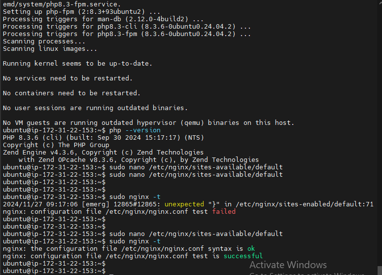

 # Step 5: Configure Nginx to Use PHP #
# After installing Nginx, MySQL, and PHP, you need to configure Nginx to process PHP files. #
# Open the default server block configuration for editing: #
 `sudo nano /etc/nginx/sites-available/default`
 # Update the server block to pass PHP requests to PHP-FPM. Ensure that the following lines are in place (under the location / block): #
`location ~ \.php$ {
  include snippets/fastcgi-php.conf;
	    fastcgi_pass unix:/var/run/php/php8.3-fpm.sock;  
  fastcgi_param SCRIPT_FILENAME $document_root$fastcgi_script_name;
  include fastcgi_params; 
	} `

# be sure to insert your php version #
# Test the Nginx configuration for errors:
 `sudo nginx -t`
   # Restart Nginx to apply the changes: #
 `sudo systemctl restart nginx `

