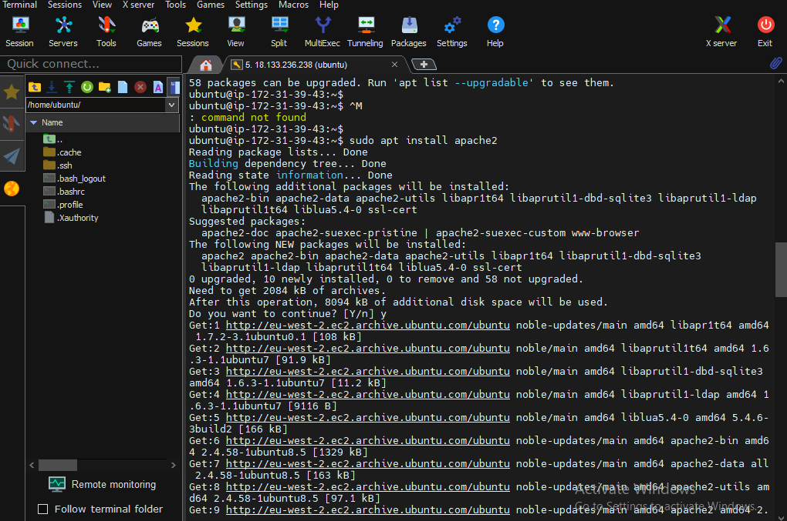

# Step 2: Install Apache (Web Server)
# To install Apache, run the following command:
 `sudo apt install apache2`

 # After installation, Apache will automatically start. You can verify this by visiting your server's IP address in a web browser. You should see the default Apache welcome page.
# To check the Apache status:#
`sudo systemctl status apache2 `
