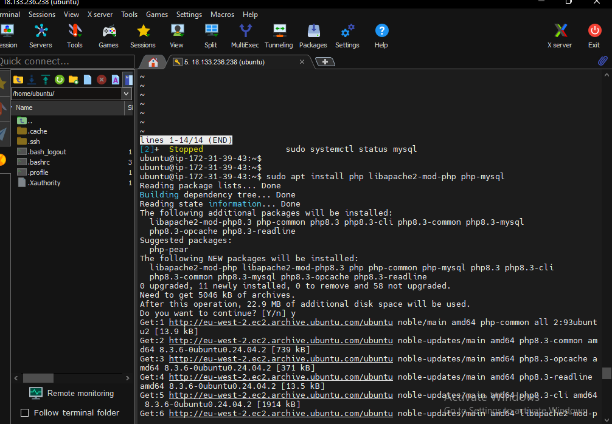

# Install PHP for apache webserver
 # To install PHP and the necessary modules to work with Apache and MySQL, run:
`sudo apt install php libapache2-mod-php php-mysql`
# This will install PHP, the Apache PHP module, and the MySQL module for PHP.
 # Restart Apache
 # After installing PHP, restart Apache to apply the changes:
`sudo systemctl restart apache2`

