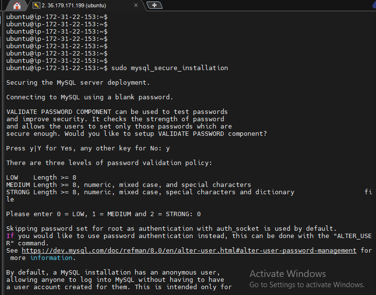

# step 3: Install MySQL Server
# To install MySQL server, use the following command:
'sudo apt install mysql-server'

 # After installation, you can secure the MySQL installation by running:
'sudo mysql_secure_installation'

# This will guide you through some important security settings for MySQL, like setting the root password.